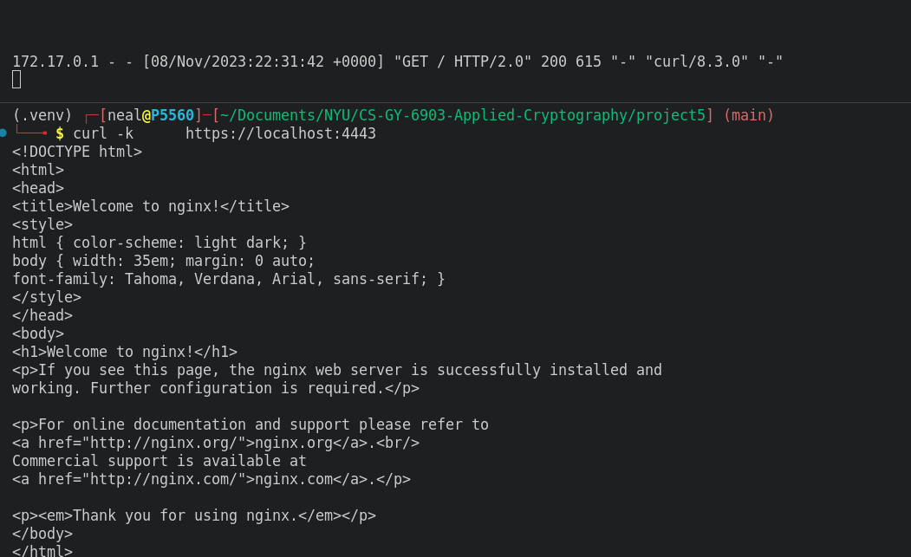
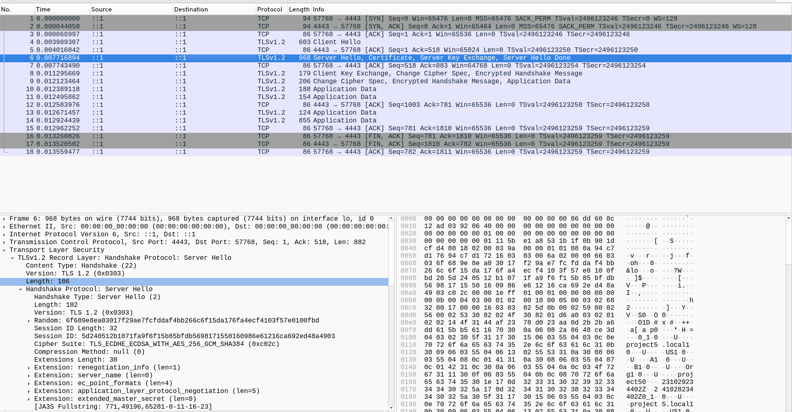
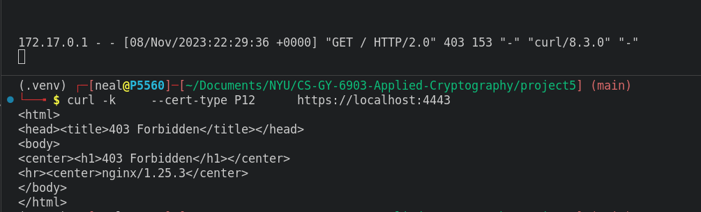
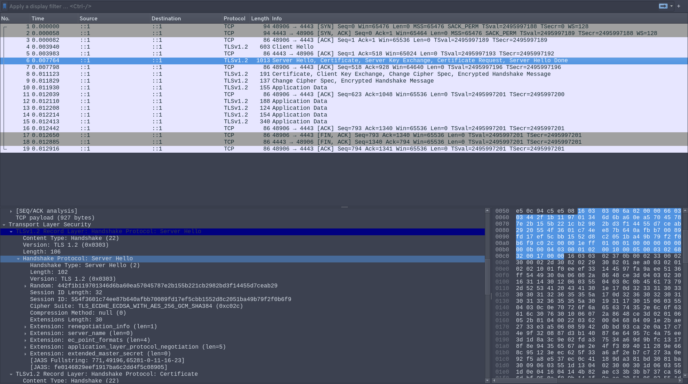
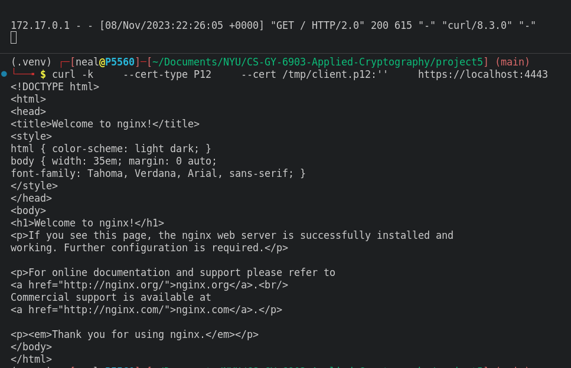
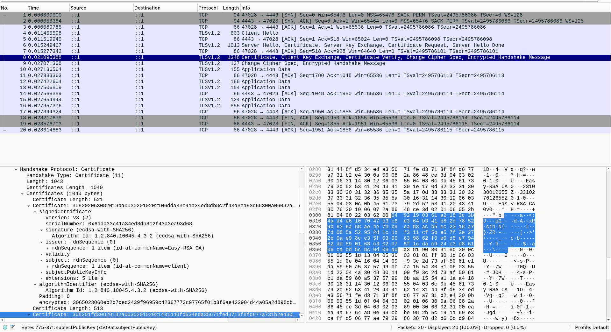
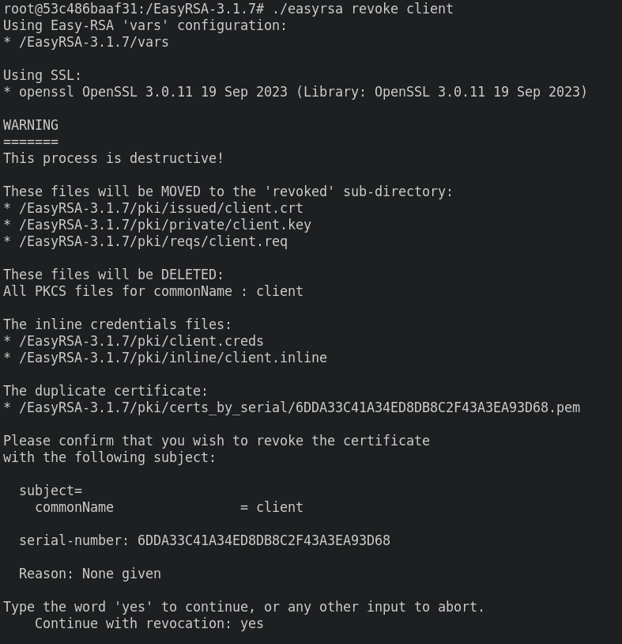
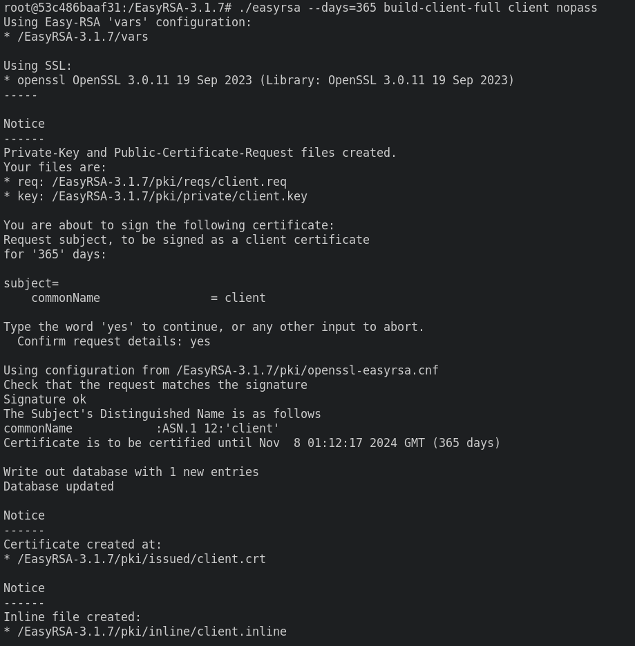
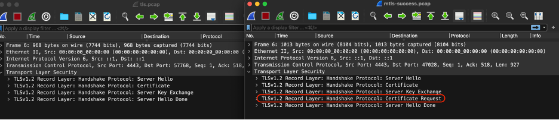

## TLS

1. On the Server
    - Create a website
        - See [TLS Docker](#tls-docker)
    - Configure https using self signed ECC certificates
        - See [TLS Nginx](#tls-nginx-config)
    - Configure your server to only answer to TLSv1.2 or TLSv1.3
        - See [TLS Nginx](#tls-nginx-config)
2. On the client
    - Start tcpdump
    - Use cURL to connect to the Server
    - Stop tcpdump
    - Review the PCAP in Wireshark to identify the TLS handshake and make sure the right protocol and certificates were used  

## mTLS

1. On the Server
    - Create a CA using easy-rsa: See [mTLS Docker](#mtls-docker)
        - Use ECC instead of RSA: See [mTLS EasyRSA Vars](#mtls-easyrsa-vars)
    - Create certificates for the Server and the Client: See [mTLS Docker](#mtls-docker)
    - Configure the server to only send the webpage if the Client is validated using mTLS: See [mTLS Nginx](#mtls-nginx)
2. On the Client
    - Start tcpdump
    - Use cURL to try to connect to the Server
    - Stop tcpdump
    - Review the PCAP in Wireshark and the NGINX log to see how MTLS failed  
    - Start tcpdump
    - Use cURL + certificates issued in 6(b) to access the server
    - Stop tcpdumo
    - Review the PCAP in Wireshark and the NGINX log to see how MTLS succeed  
3. On the Server
    - Revoke the Client’s certificate
        - 
    - Issue a new Client certificate
        - 
    - How do you inform the server that the Client’s old certificate should be rejected?
        - The nginx `ssl_crl` directive can be used for keeping track of revoked certificates after running the `./easyrsa gen-crl` command. In our code, the nginx directive would be under the https server scope `ssl_crl /EasyRSA-3.1.7/pki/crl.pem;`

## Discussion

- How should you protect the PKI you created on the Server?
- How often should regenerate the CRL?
  - Every time a certificate is revoked
- What differences do you notice in the TLS handshake during mTLS vs TLS?

The main difference in a TLS handshake between mTLS & TLS is that mTLS has an additional handshake protocol – Certificate Request (see image below).
This is the Certificate Request Protocol (CRP) and is used in mTLS to exchange certificate requests/responses between the client and server. Both the client and server must authenticate each other using their own digital certificates, and the CRP is the client’s request to retrieve the server’s certificate.
The TLS pcap does not require the CRP because, in most cases, the client and the server already have the certificates to authenticate each other. The client is able to retrieve the server’s certificate from a Certificate Authority (CA) and the client can provide its certificate - from its certificate store - to the server. Although, if the client is unable to provide a certificate, then this is when the Certificate Request Protocol can be invoked.



- What do you think would happen if you tried to use a client that was configured to only use RSA ciphers?
 
 If a client was configured to only use RSA ciphers, there could be a high possibility of it failing to connect to a server. The main reason is because as the client and server communicates during the handshake, the two sides would not be able to reach an agreement on the cipher suite to use if the server was not utilizing RSA. Cipher suites are used for:
 
- Key exchange algorithms to determine how keys are exchanged.
    * Examples: RSA, Diffie-Hellman, or Elliptic-curve Diffie-Hellman
- Authentication/Digital Signature Algorithm to determine how client and server authentication will be deployed.
   * Examples: RSA or Elliptic-curve Digital Signature Algorithm (ECDSA)
- Bulk encryption algorithms to encrypt the data.
    * Examples: AES or CHACHA20
- Message Authentication Code (MAC) algorithms to determine how the data integrity checks will be carried out.
  * Examples: Hash-based MAC (HMAC-SHA256) or Keccak-based MAC (KMAC)

 
  In the case where only the server only used elliptic curve algorithms, the client and server would try to decide if they could agree on a cipher to use, and if they could not come to an agreement, they would likely terminate the handshake, and show an error to the user.

## TLS Configs

### TLS Docker

```docker
FROM nginx:1.25.3

RUN mkdir -p /etc/nginx/ssl/ && \
    openssl ecparam -genkey -name secp384r1 -out project5.local.key && \
    openssl ec -in project5.local.key -text -noout  && \
    openssl req -new -sha256 -key project5.local.key -subj "/CN=project5.local/C=US/ST=A/L=B/O=Org/OU=project5" -out project5.local.csr && \
    openssl req -in project5.local.csr -text -noout | grep -i "Signature.*SHA256" && echo "All is well" && \
    openssl req -x509 -sha256 -days 365 -key project5.local.key -in project5.local.csr -out project5.local.crt && \
    mv project5.local.crt project5.local.key /etc/nginx/ssl/

RUN chown -R nginx:nginx /etc/nginx/ssl/

COPY default.conf /etc/nginx/conf.d/default.conf
```

### TLS Nginx Config

```nginx
server {
    listen              443 ssl http2;
    listen              [::]:443 ssl http2;
    server_name         project5.local;

    # SSL
    ssl_certificate     /etc/nginx/ssl/project5.local.crt;
    ssl_certificate_key /etc/nginx/ssl/project5.local.key;
    ssl_protocols TLSv1.2 TLSv1.3;
    ssl_prefer_server_ciphers off;

    # logging
    error_log           /var/log/nginx/error.log debug;

    location / {
        root   /usr/share/nginx/html;
        index  index.html index.htm;
    }
    error_page   500 502 503 504  /50x.html;
    location = /50x.html {
        root   /usr/share/nginx/html;
    }
}

# subdomains redirect
server {
    listen              443 ssl http2;
    listen              [::]:443 ssl http2;
    server_name         *.project5.local;

    # SSL
    ssl_certificate     /etc/nginx/ssl/project5.local.crt;
    ssl_certificate_key /etc/nginx/ssl/project5.local.key;
    return              301 https://project5.local$request_uri;
}

# HTTP redirect
server {
    listen      80;
    listen      [::]:80;
    server_name .project5.local;
    return      301 https://project5.local$request_uri;
}
```

## mTLS Configs

### mTLS Docker

```docker
FROM nginx:1.25.3

ADD https://github.com/OpenVPN/easy-rsa/releases/download/v3.1.7/EasyRSA-3.1.7.tgz /tmp/EasyRSA-3.1.7.tgz

RUN tar zxvf /tmp/EasyRSA-3.1.7.tgz && \
    rm /tmp/EasyRSA-3.1.7.tgz

WORKDIR /EasyRSA-3.1.7

COPY easyrsa.vars /EasyRSA-3.1.7/vars

RUN ./easyrsa init-pki && \
    echo | ./easyrsa build-ca nopass && \
    echo "yes" | ./easyrsa build-server-full "project5.local" nopass

RUN mkdir -p /etc/nginx/ssl/ && \
    cp pki/ca.crt /etc/nginx/ssl/ca.crt && \
    cp pki/issued/project5.local.crt /etc/nginx/ssl/project5.local.crt && \
    cp pki/private/project5.local.key /etc/nginx/ssl/project5.local.key && \
    chown -R nginx:nginx /etc/nginx/ssl

RUN echo "yes" | ./easyrsa --days=365 build-client-full client nopass && \
    ./easyrsa export-p12 client nopass

COPY default.conf /etc/nginx/conf.d/default.conf
```

### mTLS Nginx

```nginx
server {
    listen              443 ssl http2;
    listen              [::]:443 ssl http2;
    server_name         project5.local;

    # SSL
    ssl_protocols TLSv1.2 TLSv1.3;
    ssl_certificate     /etc/nginx/ssl/project5.local.crt;
    ssl_certificate_key /etc/nginx/ssl/project5.local.key;
    ssl_client_certificate /etc/nginx/ssl/ca.crt;
    ssl_verify_client optional;
    # ssl_crl /EasyRSA-3.1.7/pki/crl.pem;

    # logging
    error_log           /var/log/nginx/error.log debug;

    location / {
        if ($ssl_client_verify != SUCCESS) {
            return 403;
        }
        root   /usr/share/nginx/html;
        index  index.html index.htm;
    }
    error_page   500 502 503 504  /50x.html;
    location = /50x.html {
        root   /usr/share/nginx/html;
    }
}

# subdomains redirect
server {
    listen              443 ssl http2;
    listen              [::]:443 ssl http2;
    server_name         *.project5.local;

    # SSL
    ssl_certificate     /etc/nginx/ssl/project5.local.crt;
    ssl_certificate_key /etc/nginx/ssl/project5.local.key;
    return              301 https://project5.local$request_uri;
}

# HTTP redirect
server {
    listen      80;
    listen      [::]:80;
    server_name .project5.local;
    return      301 https://project5.local$request_uri;
}
```

### mTLS EasyRSA Vars

```
set_var EASYRSA_ALGO ec
set_var EASYRSA_CURVE secp384r1

set_var EASYRSA_DN "cn_only"

set_var EASYRSA_REQ_COUNTRY "US"
set_var EASYRSA_REQ_PROVINCE "California"
set_var EASYRSA_REQ_CITY "San Francisco"
set_var EASYRSA_REQ_ORG "Copyleft Certificate Co"
set_var EASYRSA_REQ_EMAIL "me@example.net"
set_var EASYRSA_REQ_OU "My Organizational Unit"
```
